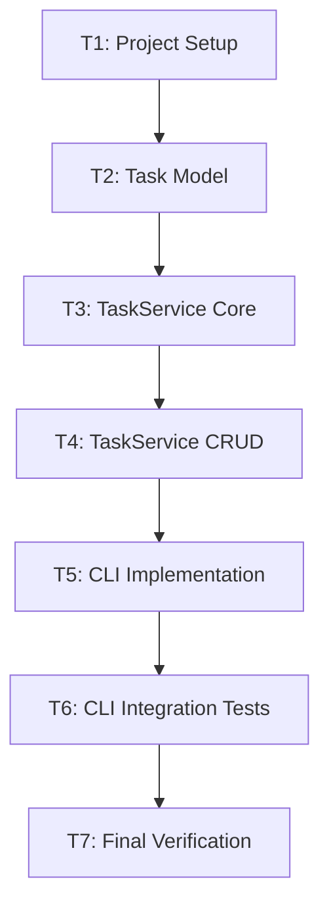

# Implementation Tasks: Phase 1 - CLI In-Memory Todo

**Feature**: `cli-todo`
**Created**: 2026-02-05

---

## Task Breakdown

### T1: Project Setup
- [x] Create directory structure
- [ ] Create `pyproject.toml` with project metadata
- [ ] Create `__init__.py` files for packages
- [ ] Create `README.md` with setup instructions

### T2: Task Model (RED → GREEN)
- [ ] Write unit tests for `Task` dataclass
- [ ] Write unit tests for `TaskStatus` enum
- [ ] Implement `Task` dataclass in `src/models/task.py`
- [ ] Verify tests pass

### T3: TaskService Core (RED → GREEN)
- [ ] Write unit tests for `add()` method
- [ ] Write unit tests for `get_all()` method
- [ ] Write unit tests for `get()` method
- [ ] Implement `TaskService` with add/get_all/get
- [ ] Verify tests pass

### T4: TaskService CRUD (RED → GREEN)
- [ ] Write unit tests for `update()` method
- [ ] Write unit tests for `delete()` method
- [ ] Write unit tests for `toggle_complete()` method
- [ ] Implement update/delete/toggle_complete
- [ ] Verify tests pass

### T5: CLI Implementation
- [ ] Create argparse base with subcommands
- [ ] Implement `add` command
- [ ] Implement `list` command
- [ ] Implement `update` command
- [ ] Implement `delete` command
- [ ] Implement `complete` command

### T6: CLI Integration Tests
- [ ] Write integration tests for add command
- [ ] Write integration tests for list command
- [ ] Write integration tests for update/delete/complete
- [ ] Write integration tests for error cases
- [ ] Verify all tests pass

### T7: Final Verification
- [ ] Run full test suite with coverage
- [ ] Verify 80%+ coverage on services
- [ ] Manual CLI walkthrough
- [ ] Update README with usage examples

---

## Execution Order

---

## Acceptance Checklist

- [ ] All unit tests pass
- [ ] All integration tests pass  
- [ ] Coverage ≥ 80% for services
- [ ] CLI help text is clear
- [ ] Error messages are user-friendly
- [ ] README is complete
