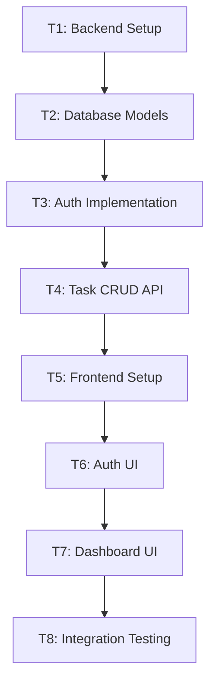

# Implementation Tasks: Phase 2 - Full-Stack Todo Web App

**Feature**: `fullstack-web`
**Created**: 2026-02-05

---

## Task Breakdown

### T1: Backend Setup
- [ ] Create `requirements.txt` with dependencies
- [ ] Create `.env.example` with required variables
- [ ] Set up `config.py` for settings management
- [ ] Set up `database.py` with SQLModel engine
- [ ] Create `main.py` FastAPI app entry point

### T2: Database Models
- [ ] Create `User` SQLModel
- [ ] Create `Task` SQLModel with user_id FK
- [ ] Test database connection and table creation

### T3: Auth Implementation
- [ ] Implement password hashing (bcrypt)
- [ ] Implement JWT token creation/verification
- [ ] Create auth router with signup/signin/signout
- [ ] Create JWT verification dependency
- [ ] Write auth tests

### T4: Task CRUD API
- [ ] Create task router with CRUD endpoints
- [ ] Implement user-scoped task queries
- [ ] Implement complete toggle endpoint
- [ ] Add proper error handling (404, 403)
- [ ] Write task API tests

### T5: Frontend Setup
- [ ] Initialize Next.js project with TypeScript
- [ ] Configure Tailwind CSS
- [ ] Set up project structure
- [ ] Create API client utility

### T6: Auth UI
- [ ] Create login page
- [ ] Create signup page
- [ ] Implement auth context/state
- [ ] Add protected route logic

### T7: Dashboard UI
- [ ] Create task list component
- [ ] Create task item component
- [ ] Create add task form
- [ ] Implement edit/delete UI
- [ ] Add loading states and error handling

### T8: Integration & Testing
- [ ] End-to-end testing
- [ ] Cross-browser testing
- [ ] Mobile responsiveness testing
- [ ] Fix bugs and polish UI

---

## Execution Order

---

## Acceptance Checklist

- [ ] Backend runs on localhost:8000
- [ ] Frontend runs on localhost:3000
- [ ] User can signup and login
- [ ] User can CRUD tasks
- [ ] Tasks persist in database
- [ ] Users only see their own tasks
- [ ] UI is responsive on mobile
- [ ] All tests pass
