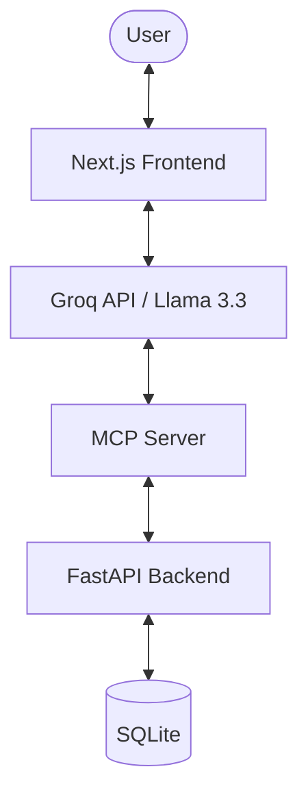

# Phase 3 Plan: MCP & Agent Integration

## Architecture Overview

The system will transition to an AI-augmented architecture.

## Technical Components

### 1. MCP Server (Python/FastAPI)
- Will run alongside the current backend or as a new endpoint.
- Uses `mcp-sdk` to define tools.
- Authenticates with the Phase 2 backend using the same JWT mechanism.

### 2. Groq API Integration (Replacement for OpenAI)
- Uses **Groq API** directly in the Next.js frontend (Edge/Serverless routes).
- Llama 3.3 (70B) provides fast, accurate tool calling.
- Tool definitions are mapped to Groq-compatible tool schemas.

### 3. Frontend Chat UI
- **ChatWindow**: New component with message history.
- **MessageBubble**: Support for AI and User styles.
- **ToolInvocation**: Subtle visual indicator when the agent is using a tool.

## Implementation Steps

### Phase 3.1: MCP Development
1. Create `Phase3/mcp-server/`.
2. Implement tools for Tasks (CRUD).
3. Test MCP server with standard MCP clients (like Claude Desktop or Inspector).

### Phase 3.2: Frontend Integration
1. Install OpenAI Agents SDK.
2. Create `/api/chat` route.
3. Build the Chat UI component.
4. Connect the Chat UI to the Agent.

### Phase 3.3: Refinement
1. Sync state between Chat and Task List.
2. Add "Voice to Text" (optional but recommended).
