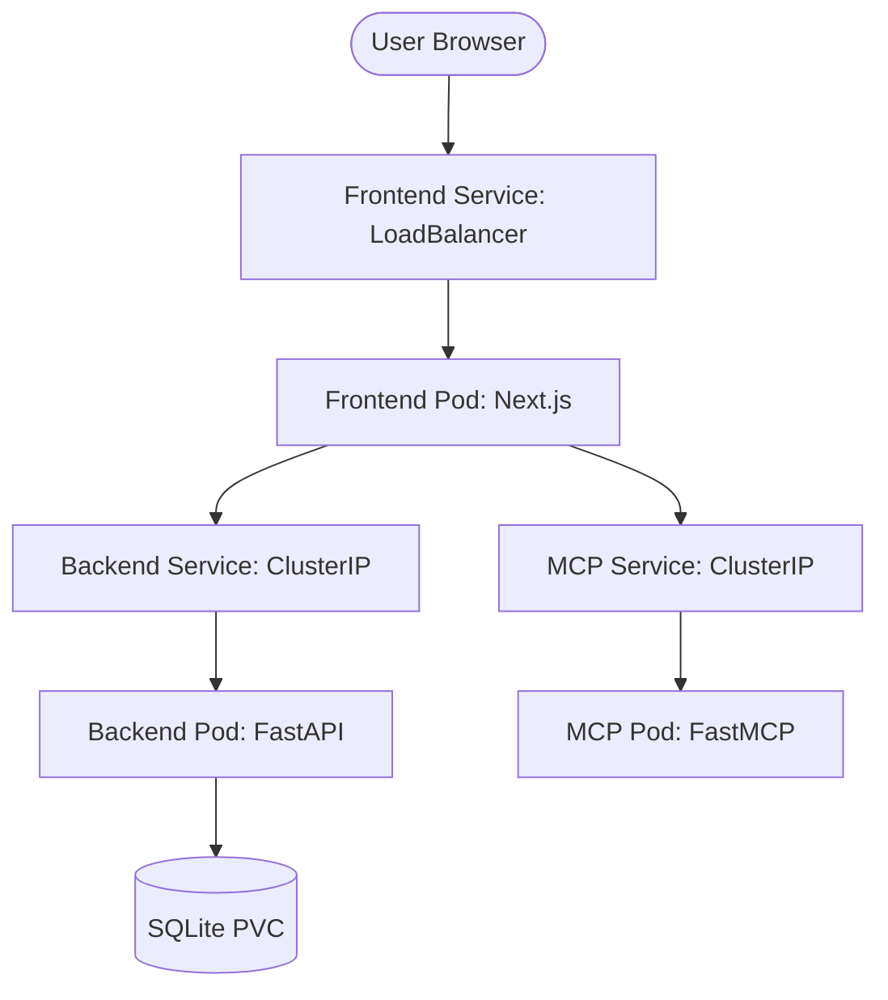

# Phase 4 Implementation Plan: Kubernetes Transition

## Architecture Diagram (Overview)

## Proposed Changes

### 🐳 Containerization
#### [NEW] [Dockerfile (Backend)](file:///d:/1-GIAIC%20Course/Hackathon%20II%20-%20Todo%20Spec-Driven%20Development/Phase2/backend/Dockerfile)
- Multi-stage build starting from `python:3.11-slim`.
- Installs dependencies from `requirements.txt`.
- Exposes port 8888.

#### [NEW] [Dockerfile (MCP)](file:///d:/1-GIAIC%20Course/Hackathon%20II%20-%20Todo%20Spec-Driven%20Development/Phase3/mcp-server/Dockerfile)
- Standard `python:3.11-slim` build.
- Exposes port 8000.

#### [NEW] [Dockerfile (Frontend)](file:///d:/1-GIAIC%20Course/Hackathon%20II%20-%20Todo%20Spec-Driven%20Development/Phase2/frontend/Dockerfile)
- Multi-stage Node.js build (`node:18-alpine`).
- Production build of Next.js app.
- Exposes port 3000.

### ☸️ Kubernetes Manifests
#### [NEW] [namespace.yaml](file:///d:/1-GIAIC%20Course/Hackathon%20II%20-%20Todo%20Spec-Driven%20Development/Phase4/kubernetes/namespace.yaml)
- Defines the `mansoori-todo` namespace.

#### [NEW] [secrets.yaml](file:///d:/1-GIAIC%20Course/Hackathon%20II%20-%20Todo%20Spec-Driven%20Development/Phase4/kubernetes/secrets.yaml)
- Stores `GROQ_API_KEY` and other sensitive environment variables.

#### [NEW] [storage.yaml](file:///d:/1-GIAIC%20Course/Hackathon%20II%20-%20Todo%20Spec-Driven%20Development/Phase4/kubernetes/storage.yaml)
- Defines `PersistentVolume` and `PersistentVolumeClaim` for the SQLite database.

#### [NEW] [deployments.yaml](file:///d:/1-GIAIC%20Course/Hackathon%20II%20-%20Todo%20Spec-Driven%20Development/Phase4/kubernetes/deployments.yaml)
- Three separate `Deployment` objects for Frontend, Backend, and MCP Server.
- Configures health checks (liveness/readiness probes).

#### [NEW] [services.yaml](file:///d:/1-GIAIC%20Course/Hackathon%20II%20-%20Todo%20Spec-Driven%20Development/Phase4/kubernetes/services.yaml)
- Defines `Service` objects for each deployment.

## Verification Plan

### Automated Tests
- `kubectl get pods`: Verify all pods are in `Running` state.
- `kubectl logs`: Check for any startup errors in each pod.

### Manual Verification
1. Access the application via Minikube tunnel/IP.
2. Sign up and add a few tasks.
3. Delete the backend pod and verify tasks PERSIST in the new pod (PVC check).
4. Use the AI chatbot to verify inter-service communication.
